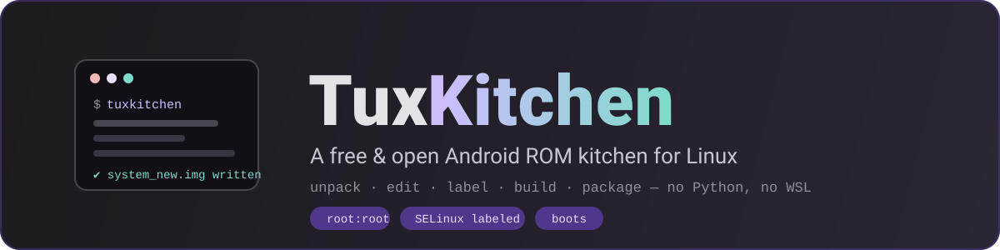
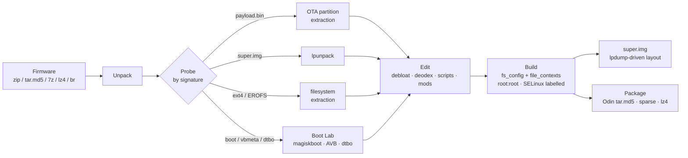

<p align="center">
  
</p>

<h1 align="center">TuxKitchen</h1>

<p align="center">
  <strong>Take a ROM apart. Put it back together. On Linux, for free.</strong><br/>
  <sub>Unpack · Edit · Label · Build · Package — Rust + Tauri, no Python, no WSL, no licence server.</sub>
</p>

<p align="center">
  <a href="#-license"></a>
  <a href="https://github.com/Redminote11tech/tuxkitchen/releases"></a>
  
  
  
</p>

---

## Why

The good ROM kitchens for Windows are closed and paid. The free ones drive Python
scripts through a terminal. **TuxKitchen** is neither: a native desktop app that
drives your system's ROM tooling directly — every operation streams real command
output into a built-in console, every image is identified by its *signature*, and
every build applies the ownership and SELinux metadata that is the difference
between a phone that boots and one that doesn't.

It is a kitchen in the classic sense (Magisk, vbmeta, super.img, Odin tars,
deodex, debloat), rebuilt as a modern Linux app.

## The round trip



## Features

| | |
|---|---|
| **Unpack** | Firmware archives (zip / tar / tar.md5 / 7z / lz4 / br / gz / xz), `super.img` via `lpunpack`, ext4 via 7z, EROFS via `fsck.erofs` |
| **Probe** | Every file identified by header signature, not extension: boot, vendor_boot, vbmeta, payload.bin, sparse, ext, EROFS, F2FS, dtbo, tar, zip and the common compression streams |
| **payload.bin** | Full-OTA payload extraction with a hand-written protobuf reader (ZERO / REPLACE / REPLACE_BZ / REPLACE_XZ); delta operations are reported honestly, never guessed |
| **dtbo** | Split and repack device-tree overlay tables — pure Rust, no Python `mkdtboimg` |
| **Boot Lab** | `magiskboot` unpack/repack, real Magisk patching through upstream `boot_patch.sh` (v30.7, unmodified), vbmeta flags 3, Samsung disarm (RKP / defex / PROCA hexpatches) across boot · vendor_boot · vbmeta |
| **Kernel config** | Reads the config embedded in the kernel (CONFIG_IKCONFIG) after boot unpack: ext4 / EROFS / F2FS support and compression algorithms shown as chips, and every filesystem build warns when the kernel can't mount what you're about to produce |
| **Build** | ext4 (`mke2fs` + `e2fsdroid`, with a verified `debugfs` fallback), F2FS (`mkfs.f2fs` + `sload.f2fs`), EROFS with lz4 / lz4hc selection — all with fs_config ownership and SELinux labelling, post-build verification, and per-partition metadata coverage reports |
| **super.img** | `lpmake` build that reads the stock layout with `lpdump` (group name, metadata slots) and logs the per-partition budget before building |
| **Package** | Odin `.tar` and `.tar.md5` (MD5 appended exactly the way Odin verifies), raw ⇄ sparse, lz4, and `NEW.DAT` transfer-list reconstruction (full-image lists; incremental OTA lists are rejected honestly) |
| **Compare** | Two trees walked path by path — stock extract vs your edits, or two firmware releases. Same-size files compared byte for byte; statuses filterable; honest about what it does not do (no jar/dex or metadata diffs) |
| **Device** | ADB and fastboot detection, device properties, bootloader variables (slot, lock state, fastbootd, partition sizes), reboots into bootloader / fastbootd / recovery / download. Flashing is plan-then-acknowledge, not paternalistic: identity/radio partitions and the bootloader chain require explicit, specific acknowledgements (identity adds a typed confirmation), fastbootd needs are flagged for dynamic partitions, oversized images are blocked because they physically cannot flash |
| **Debloat** | App list with real directory sizes; removal moves apps into a restorable project backup; recursive deodex that finds `oat/<isa>/` layouts and clears stale `.vdex` / `.art` |
| **build.prop editor** | Auto-detects every prop file in the workspace; table editing with a raw mode; comments and blanks survive every save; a `.prop.bak` of the previous version is kept alongside |
| **File browser** | Breadcrumb navigation through the extracted ROM; click a file to identify it by signature; rename and delete (delete moves into the restorable backup) |
| **APK tooling** | Decompile / recompile with `apktool`, and **sign** the result (v1+v2+v3 via uber-apk-signer) — unsigned apktool output cannot install; signing is one click from the file browser |
| **Ramdisk editing** | Extract `ramdisk.cpio` into an editable folder straight from a boot unpack, edit via the Files browser (fstab, init.rc, …), rebuild — untouched entries keep their original ownership, modes and timestamps because the archive is patched, not regenerated. A pristine copy is kept as `ramdisk.orig.cpio` |
| **Workflow** | Projects with their own workspaces, a persistent global console, toast notifications, a busy indicator for long operations, and a Tools screen that maps every missing dependency to its install command |

## The metadata story

Most kitchen rebuilds produce images full of files owned by your desktop user
with no SELinux labels — they extract fine and they bootloop. TuxKitchen treats
metadata as first class:

1. On build, the tree is walked and a **fs_config** binary is generated:
   everything `root:root`, exec bits preserved, mode `0755` / `0644`.
2. The ROM's own **file_contexts** is located in the workspace (a compiled
   `file_contexts.bin` is decompiled when the tool exists) and applied with
   `e2fsdroid -S`, `sload.f2fs -s`, or the built-in `debugfs` labeller.
3. A **coverage report** names every path no rule would label, before you flash
   anything.

This is verified by tests that build a real image and read it back with
`debugfs` — see [Verification](#verification).

## Install

### CachyOS / Arch Linux — package

Grab `tuxkitchen-0.3.1-1-x86_64.pkg.tar.zst` from
[Releases](https://github.com/Redminote11tech/tuxkitchen/releases) (or build it
yourself), then:

```sh
sudo pacman -U tuxkitchen-0.3.1-1-x86_64.pkg.tar.zst
tuxkitchen
```

Installs a desktop entry, icons and a launcher. The launcher keeps WebKit's
DMABUF renderer enabled — the fast path, smooth scrolling. If your machine
shows a blank or flickering window (older NVIDIA drivers are the usual
suspect), start it once with `WEBKIT_DISABLE_DMABUF_RENDERER=1 tuxkitchen`;
you trade the glitch for slower scrolling.

### AppImage — any distro

Download `tuxkitchen_0.3.1_amd64.AppImage`, make it executable, run:

```sh
chmod +x tuxkitchen_0.3.1_amd64.AppImage
./tuxkitchen_0.3.1_amd64.AppImage
```

The kitchen drives **your system's** tooling — run the built-in **Tools**
screen to see what each workflow needs.

### Build from source

```sh
git clone https://github.com/Redminote11tech/tuxkitchen
cd tuxkitchen
bun install
bun run tauri dev          # development
bun run tauri build        # production bundle
cd packaging && ./build-package.sh --force   # Arch package
```

<details>
<summary><strong>Tool matrix</strong> — what each feature needs on PATH</summary>

| Tool | Needed for | Package |
|---|---|---|
| `magiskboot` | boot unpack/repack, Magisk patching, Samsung disarm | AUR `magiskboot` / `magiskboot-bin` |
| `unzip` `7z` `tar` | archive and ext4 extraction | `unzip` `7zip` `tar` |
| `lz4` `brotli` | Samsung lz4, dat.br | `lz4` `brotli` |
| `simg2img` `img2simg` `lpmake` `lpdump` | sparse conversion, super build, layout readout | `android-tools` |
| `mke2fs` `e2fsck` `debugfs` | ext4 build, verification, metadata fallback | `e2fsprogs` |
| `mkfs.f2fs` `sload.f2fs` | F2FS build + population | `f2fs-tools` |
| `mkfs.erofs` `fsck.erofs` | EROFS build + extraction | `erofs-utils` |
| `xz` `bzip2` `zstd` | payload.bin blobs | `xz` `bzip2` `zstd` |
| `baksmali` | deodexing | AUR `android-apktool` |
| `avbtool` | verifying patched vbmeta | `android-tools` |
| `sefcontext_decompile` | decompiling `file_contexts.bin` | not packaged on Arch — supply a text file instead |

</details>

## Verification

`cargo test` — 14 tests, including two end-to-end pipeline tests that build a
real image and read it back with `debugfs`:

- **ext4**: files come out `root:root` with correct modes; `security.selinux`
  xattrs are present on files *and* symlinks.
- **f2fs**: `sload.f2fs` accepts the generated fs_config binary and contexts
  (label readback would need a mount — acceptance is what's pinned).
- **vbmeta**: flags land at the correct AVB offset (120, big-endian; rollback
  index untouched); `avbtool info_image` reads back `Flags: 3`
  (HASHTREE_DISABLED | VERIFICATION_DISABLED, matching Magisk's
  PATCHVBMETAFLAG).
- **Magisk**: the real upstream `boot_patch.sh` runs unmodified; `magiskboot
  cpio test` classifies the output as Magisk-patched and the ramdisk contains
  `magiskinit`.
- **super**: `lpmake --device-size auto` output round-trips through `lpunpack`.

```sh
cd src-tauri && cargo test
```

## Honest limitations

- F2FS **extraction** needs a root mount — the button is disabled rather than
  fake. F2FS *building* works.
- Delta OTA payloads (SOURCE_COPY / BSDIFF / PUFFDIFF) need the old image and
  are reported, not applied. Full payloads extract.
- Arch's `e2fsdroid` build currently rejects valid ext4 images; TuxKitchen
  detects the failure and falls back to its `debugfs` labeller automatically.
- Paths with spaces or quotes can't be addressed by the debugfs batch — they
  are counted and reported in the log.
- Nothing here certifies flashable output: verified against synthetic fixtures
  and host tools only. **No device was flashed.** Use disposable copies.

## Credits & positioning

- [MIO-KITCHEN](https://github.com/ColdWindScholar/MIO-KITCHEN-SOURCE) — the
  free-kitchen reference this project looks up to; TuxKitchen reimplements the
  core ideas natively in Rust with zero Python.
- [CRB Android Kitchen](https://xdaforums.com/t/crb-android-kitchen-windows-linux-tool-v4-0-0.3947779/)
  — the feature bar to measure against; it's paid and closed, TuxKitchen aims
  to be neither.
- [Magisk](https://github.com/topjohnwu/Magisk) and
  [osm0sis's AIK](https://github.com/osm0sis/Android-Image-Kitchen) — run
  unmodified where used; no part of either is redistributed.

## Contributing

Issues and PRs are welcome. Keep the bar that makes this repo what it is:
new features arrive with tests, tool fallbacks are explicit in the log, and
"will this boot" questions are answered with metadata, not hope.

## License

[GPL-3.0](LICENSE) — free as in kitchen.

## Disclaimer

Building images cannot brick a phone. Flashing can. Keep the stock firmware
for your exact model at hand, use disposable copies of everything, and treat
every write as the moment that needs your full attention. The authors take no
responsibility for damaged devices.
